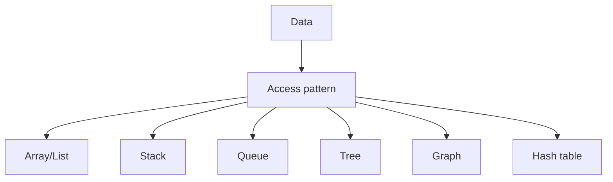

# tree

used for hierarchy

![[Pasted image 20260902152928.png]]

![[Pasted image 20260902152950.png]]

ml in clasificaution test

![[Pasted image 20260902154232.png]]

## Complete notes

Tree is a hierarchical data structure.

It has one root node and child nodes.

## Terms

- Root is the top node.
- Parent has children.
- Child is below a parent.
- Leaf has no children.
- Height is the longest path from root to leaf.

## Common trees

- Binary tree.
- Binary search tree.
- Heap.
- Trie.

## Use cases

- Folder structure.
- DOM tree.
- Search indexes.
- Database indexes.

## Revision notes

### What it is

Tree stores hierarchical data with a root and children.

### Why it matters

- It helps you understand the main job of `tree`.
- It gives a mental model for interviews, revision, and building real projects.
- It connects with nearby notes in this vault, so revise it with the content table and related links.

### How to think about it

Ask these questions:

- What problem does it solve?
- What are the main parts?
- What happens step by step?
- Where is it used in real projects?
- What mistake should I avoid?

### Diagram

### Key terms

`root`, `parent`, `child`, `leaf`, `height`

### Real project example

In a real app, `tree` is not learned alone. It connects with frontend, backend, database, browser, network, and deployment decisions.

Example revision flow:

1. Define the topic in one sentence.
2. Draw the flow from memory.
3. Explain one real use case.
4. Say one advantage.
5. Say one limitation or mistake.

### Common mistakes

- Memorizing the word but not knowing the flow.
- Not knowing when to use it.
- Mixing similar topics without comparing them.
- Forgetting the tradeoff.

### Quick revision

- Main idea: Tree stores hierarchical data with a root and children.
- Remember the keywords: root, parent, child, leaf.
- Best way to revise: explain it out loud with a small example and the diagram.
