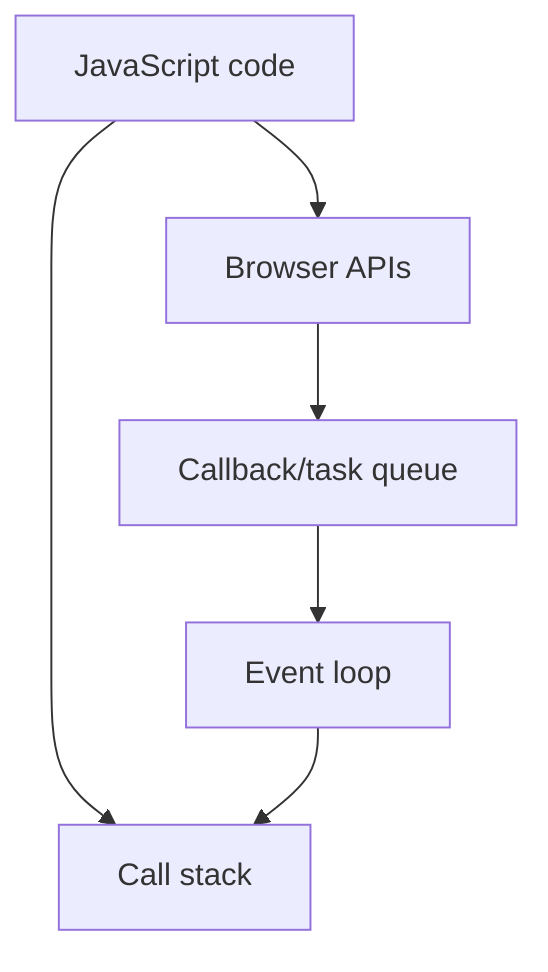

## Ways To define a array

const myArr = [0, 1, 2, 3, 4, 5]
const myHeors = ["shaktiman", "naagraj"]

const myArr2 = new Array(1, 2, 3, 4)

## Add and remove Data

myArr.push(6)
myArr.pop()

## Different way on pus and pop form front

/ myArr.unshift(9)
// myArr.shift()

## Merger 2 array s

const marvel_heros = ["thor", "Ironman", "spiderman"]
const dc_heros = ["superman", "flash", "batman"]

- *Merged Array**

const all_new_heros = [...marvel_heros, ...dc_heros]

- *Nested Arrays**

const another_array = [1, 2, 3, [4, 5, 6], 7, [6, 7, [4, 5]]]

ans:=
const real_another_array = another_array.flat(Infinity)

so the logic is to flaten the array and then merge

## Revision notes

### What it is

JavaScript arrays store ordered values and include many helper methods.

### Why it matters

- It helps you understand the main job of `Arrays`.
- It gives a mental model for interviews, revision, and building real projects.
- It connects with nearby notes in this vault, so revise it with the content table and related links.

### How to think about it

Ask these questions:

- What problem does it solve?
- What are the main parts?
- What happens step by step?
- Where is it used in real projects?
- What mistake should I avoid?

### Diagram

### Key terms

`push`, `pop`, `map`, `filter`, `reduce`, `forEach`

### Real project example

In a real app, `Arrays` is not learned alone. It connects with frontend, backend, database, browser, network, and deployment decisions.

Example revision flow:

1. Define the topic in one sentence.
2. Draw the flow from memory.
3. Explain one real use case.
4. Say one advantage.
5. Say one limitation or mistake.

### Common mistakes

- Memorizing the word but not knowing the flow.
- Not knowing when to use it.
- Mixing similar topics without comparing them.
- Forgetting the tradeoff.

### Quick revision

- Main idea: JavaScript arrays store ordered values and include many helper methods.
- Remember the keywords: push, pop, map, filter.
- Best way to revise: explain it out loud with a small example and the diagram.
