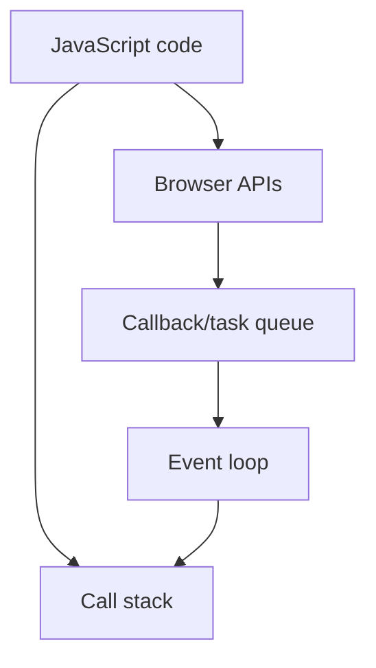

## Query Selector

const parent = document.querySelector('.parent')
select the tag with this class

## Events

document.querySelector('#images').addEventListener('click', function(e){
console.log(e.target.tagName);
if (e.target.tagName === 'IMG') {
console.log(e.target.id);
let removeIt = e.target.parentNode
removeIt.remove()
}

## Set-timeout

const changeMe = setTimeout(changeText, 2000)
so will run. this after 2 sec

## Set-Interval

const intervalId = setInterval(sayDate, 1000, "hi")

will run after 1 sec

## Revision notes

### What it is

DOM is the browser's object model for HTML, and JavaScript can read or change it.

### Why it matters

- It helps you understand the main job of `Dom`.
- It gives a mental model for interviews, revision, and building real projects.
- It connects with nearby notes in this vault, so revise it with the content table and related links.

### How to think about it

Ask these questions:

- What problem does it solve?
- What are the main parts?
- What happens step by step?
- Where is it used in real projects?
- What mistake should I avoid?

### Diagram

### Key terms

`document`, `querySelector`, `event listener`, `element`, `textContent`

### Real project example

In a real app, `Dom` is not learned alone. It connects with frontend, backend, database, browser, network, and deployment decisions.

Example revision flow:

1. Define the topic in one sentence.
2. Draw the flow from memory.
3. Explain one real use case.
4. Say one advantage.
5. Say one limitation or mistake.

### Common mistakes

- Memorizing the word but not knowing the flow.
- Not knowing when to use it.
- Mixing similar topics without comparing them.
- Forgetting the tradeoff.

### Quick revision

- Main idea: DOM is the browser's object model for HTML, and JavaScript can read or change it.
- Remember the keywords: document, querySelector, event listener, element.
- Best way to revise: explain it out loud with a small example and the diagram.
