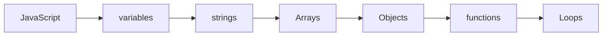

# JS Content

- Variables[[variables]]
- Strings[[strings]]
- Primitive and non primitive [[Promitive_non_Primitive_Types]]
- Arrays [[Arrays]]
- Objects[[Objects]]
- Functions[[functions]]
- scope[[scope]]
- Loops[[Loops]]
- Filters[[filters]]
- Dom[[Dom]]
- Promises[[Promises]]

## Complete notes

JavaScript topic map:

- [[variables]] stores data.
- [[strings]], [[Arrays]], and [[Objects]] are common data types.
- [[functions]] stores reusable logic.
- [[Loops]] repeats work.
- [[Promises]] and async/await handle asynchronous code.
- [[Dom]] connects JavaScript to HTML.
- [[scope]] controls where variables are available.

## Must know

- JavaScript runs in browser and server with Node.js.
- It is event-driven in the browser.
- Most web interactivity uses JavaScript.

## Revision dashboard

### Main idea

JavaScript adds logic, interactivity, data handling, and async behavior to web apps.

### Study order

- [[variables]]
- [[strings]]
- [[Arrays]]
- [[Objects]]
- [[functions]]
- [[Loops]]
- [[Promises]]
- [[Dom]]
- [[scope]]
- [[filters]]

### Diagram

### How to revise this folder

1. Open this content table first.
2. Click each linked topic one by one.
3. Read the `Complete notes` and `Revision notes` sections.
4. Redraw the diagram from memory.
5. Explain one real example without looking.

### Revision checklist

- I can define JavaScript in one sentence.
- I can explain each linked note.
- I can draw the topic flow.
- I know one use case.
- I know one common mistake.
