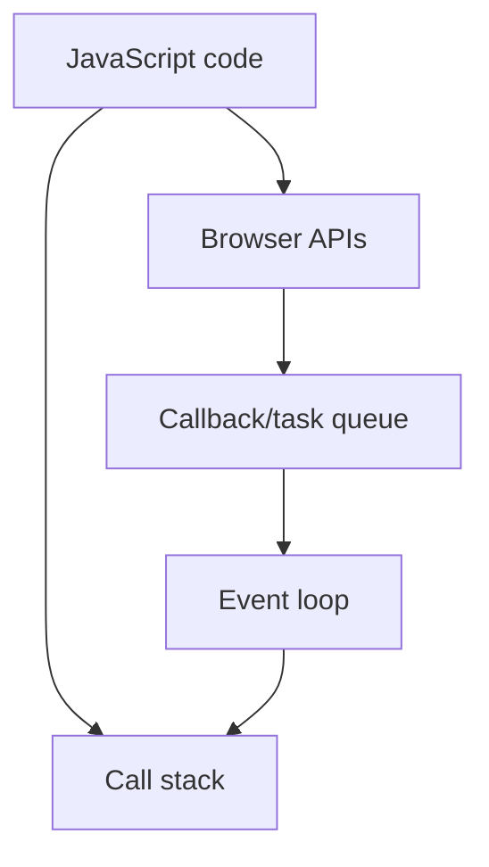

Types of Loops

- Normal for
- Normal while
- Normal Do while
- For of

## Type 1

for (let i = 0; i <= 10; i++) {
const element = i;
if (element == 5) {
//console.log("5 is best number");
}
//console.log(element);

}

## Type 2

let myArray = ['flash', "batman", "superman"]
while (arr < myArray.length) {
//console.log(`Value is ${myArray[arr]}`);
arr = arr + 1
}

## Type 3

do {
console.log(`Score is ${score}`);
score++
} while (score <= 10);

## Type 4

For of

- *Array**

const arr = [1, 2, 3, 4, 5]

for (const num of arr) {
//console.log(num);
}

- *Maps**

const map = new Map()
map.set('IN', "India")
map.set('USA', "United States of America")
map.set('Fr', "France")
map.set('IN', "India")

// console.log(map);

for (const [key, value] of map) {
// console.log(key, ':-', value);
}

- *Objects**

const myObject = {
game1: 'NFS',
game2: 'Spiderman'
}

// for (const [key, value] of myObject) {
//     console.log(key, ':-', value);

// }

## Type 5

For in

so this is used like this

const myObject = {
js: 'javascript',
cpp: 'C++',
rb: "ruby",
swift: "swift by apple"
}

for (const key in myObject) {
//console.log(`${key} shortcut is for ${myObject[key]}`);
}

## Type 6

for each

const coding = ["js", "ruby", "java", "python", "cpp"]

// coding.forEach( function (val){
//     console.log(val);
// } )

// coding.forEach( (item) => {
//     console.log(item);
// } )

## Revision notes

### What it is

Loops repeat code until a condition or collection ends.

### Why it matters

- It helps you understand the main job of `Loops`.
- It gives a mental model for interviews, revision, and building real projects.
- It connects with nearby notes in this vault, so revise it with the content table and related links.

### How to think about it

Ask these questions:

- What problem does it solve?
- What are the main parts?
- What happens step by step?
- Where is it used in real projects?
- What mistake should I avoid?

### Diagram

### Key terms

`for`, `while`, `for...of`, `break`, `continue`

### Real project example

In a real app, `Loops` is not learned alone. It connects with frontend, backend, database, browser, network, and deployment decisions.

Example revision flow:

1. Define the topic in one sentence.
2. Draw the flow from memory.
3. Explain one real use case.
4. Say one advantage.
5. Say one limitation or mistake.

### Common mistakes

- Memorizing the word but not knowing the flow.
- Not knowing when to use it.
- Mixing similar topics without comparing them.
- Forgetting the tradeoff.

### Quick revision

- Main idea: Loops repeat code until a condition or collection ends.
- Remember the keywords: for, while, for...of, break.
- Best way to revise: explain it out loud with a small example and the diagram.
