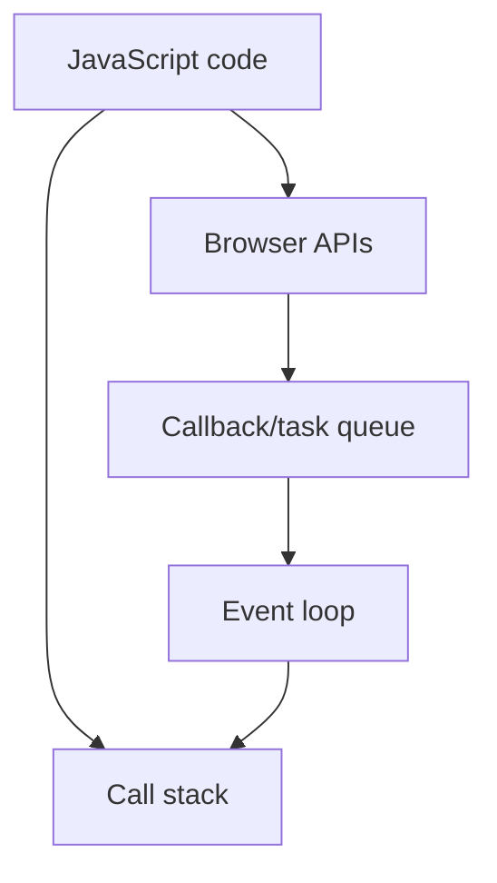

a object is a key value pair which store info

const JsUser = {
name: "Hitesh",
"full name": "Hitesh Choudhary",
Mysym:mykey
age: 18,
location: "Jaipur",
email: "hitesh@google.com",
isLoggedIn: false,
lastLoginDays: ["Monday", "Saturday"]
}

- *To print the value we use**

// console.log(JsUser.email)
// console.log(JsUser["email"])
// console.log(JsUser["full name"])
// console.log(JsUser[mySym])

- *Alter the value**

JsUser.email = "hitesh@chatgpt.com"
JsUser.email = "hitesh@microsoft.com"

## **We can also add function in a objects**

JsUser.greeting = function(){
console.log("Hello JS user");
}
JsUser.greetingTwo = function(){
console.log(`Hello JS user, ${this.name}`);
}

- *To access this e need**

console.log(JsUser.greeting());
console.log(JsUser.greetingTwo());

## we can also create object

const tinderUser = {}

tinderUser.id = "123abc"
tinderUser.name = "Sammy"
tinderUser.isLoggedIn = false

- *Example of nested objects**

const regularUser = {
email: "some@gmail.com",
fullname: {
userfullname: {
firstname: "hitesh",
lastname: "choudhary"
}
}
}

## Copy one object to another

const obj1 = {1: "a", 2: "b"}
const obj2 = {3: "a", 4: "b"}

const obj3 = {...obj1, ...obj2}
similar to arrays

## Revision notes

### What it is

JavaScript objects store key-value pairs and model structured data.

### Why it matters

- It helps you understand the main job of `Objects`.
- It gives a mental model for interviews, revision, and building real projects.
- It connects with nearby notes in this vault, so revise it with the content table and related links.

### How to think about it

Ask these questions:

- What problem does it solve?
- What are the main parts?
- What happens step by step?
- Where is it used in real projects?
- What mistake should I avoid?

### Diagram

### Key terms

`property`, `method`, `dot notation`, `bracket notation`, `destructuring`

### Real project example

In a real app, `Objects` is not learned alone. It connects with frontend, backend, database, browser, network, and deployment decisions.

Example revision flow:

1. Define the topic in one sentence.
2. Draw the flow from memory.
3. Explain one real use case.
4. Say one advantage.
5. Say one limitation or mistake.

### Common mistakes

- Memorizing the word but not knowing the flow.
- Not knowing when to use it.
- Mixing similar topics without comparing them.
- Forgetting the tradeoff.

### Quick revision

- Main idea: JavaScript objects store key-value pairs and model structured data.
- Remember the keywords: property, method, dot notation, bracket notation.
- Best way to revise: explain it out loud with a small example and the diagram.
