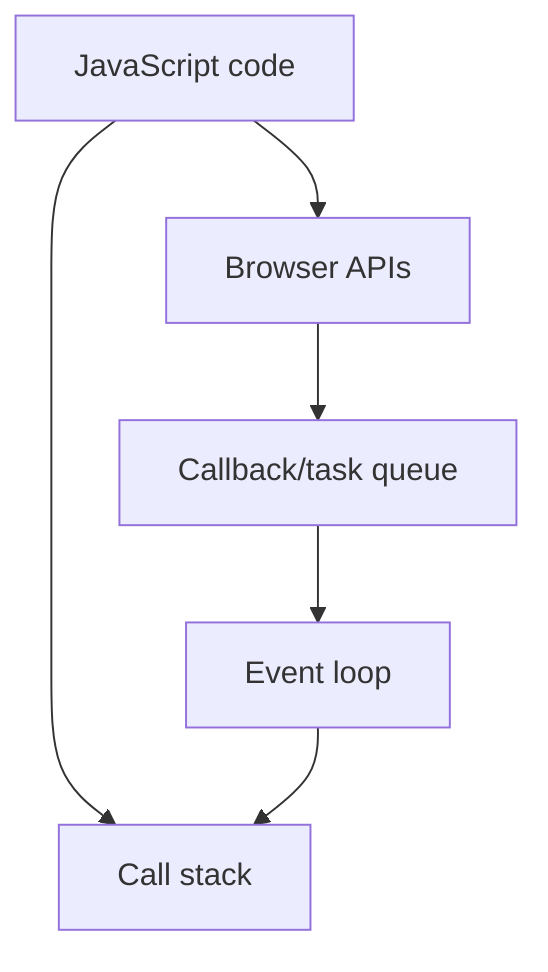

There are different types of Promises

so resolve means that it is correct ans ture
and reject means that is is false or wrong

## Type 1

const promiseOne = new Promise(function(resolve, reject){
//Do an async task
// DB calls, cryptography, network
setTimeout(function(){
console.log('Async task is compelete');
resolve()
}, 1000)
})

promiseOne.then(function(){
console.log("Promise consumed");
})

## Type 2

new Promise(function(resolve, reject){
setTimeout(function(){
console.log("Async task 2");
resolve()
}, 1000)

}).then(function(){
console.log("Async 2 resolved");
})

so .then is there it will auto automatically get called if it is resolved

## Type 3

const promiseThree = new Promise(function(resolve, reject){
setTimeout(function(){
resolve({username: "Chai", email: "chai@example.com"})
}, 1000)
})

promiseThree.then(function(user){
console.log(user);
})

## Type 4

const promiseFour = new Promise(function(resolve, reject){
setTimeout(function(){
let error = true
if (!error) {
resolve({username: "hitesh", password: "123"})
} else {
reject('ERROR: Something went wrong')
}
}, 1000)
})

promiseFour
.then((user) => {
console.log(user);
return user.username
}).then((username) => {
console.log(username);
}).catch(function(error){
console.log(error);
}).finally(() => console.log("The promise is either resolved or rejected"))

so when a .then has returned a value it goes to the next .then function

## Type 5

const promiseFive = new Promise(function(resolve, reject){
setTimeout(function(){
let error = true
if (!error) {
resolve({username: "javascript", password: "123"})
} else {
reject('ERROR: JS went wrong')
}
}, 1000)
});

async function consumePromiseFive(){
try {
const response = await promiseFive
console.log(response);
} catch (error) {
console.log(error);
}
}

consumePromiseFive()

using asyn function in this

so the resolve get called and return to asyn function

## Type 6

// async function getAllUsers(){
//     try {
//         const response = await fetch('[[Domain DNS HTTPS SSL TLS|https]]://jsonplaceholder.typicode.com/users')

//         const data = await response.json()
//         console.log(data);
//     } catch (error) {
//         console.log("E: ", error);
//     }
// }

//getAllUsers()

## Type 7

fetch('https://api.github.com/users/hiteshchoudhary')
.then((response) => {
return response.json()
})
.then((data) => {
console.log(data);
})
.catch((error) => console.log(error))

## Revision notes

### What it is

Promise represents an async value that may succeed or fail later.

### Why it matters

- It helps you understand the main job of `Promises`.
- It gives a mental model for interviews, revision, and building real projects.
- It connects with nearby notes in this vault, so revise it with the content table and related links.

### How to think about it

Ask these questions:

- What problem does it solve?
- What are the main parts?
- What happens step by step?
- Where is it used in real projects?
- What mistake should I avoid?

### Diagram

### Key terms

`pending`, `fulfilled`, `rejected`, `then`, `catch`, `async/await`

### Real project example

In a real app, `Promises` is not learned alone. It connects with frontend, backend, database, browser, network, and deployment decisions.

Example revision flow:

1. Define the topic in one sentence.
2. Draw the flow from memory.
3. Explain one real use case.
4. Say one advantage.
5. Say one limitation or mistake.

### Common mistakes

- Memorizing the word but not knowing the flow.
- Not knowing when to use it.
- Mixing similar topics without comparing them.
- Forgetting the tradeoff.

### Quick revision

- Main idea: Promise represents an async value that may succeed or fail later.
- Remember the keywords: pending, fulfilled, rejected, then.
- Best way to revise: explain it out loud with a small example and the diagram.
