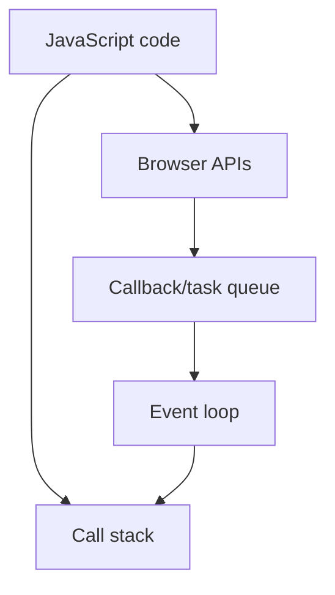

### Primitive

const score = 100
const scoreValue = 100.3

const isLoggedIn = false
const outsideTemp = null
let userEmail;

const id = Symbol('123')
const anotherId = Symbol('123')

console.log(id === anotherId);

// const bigNumber = 3456543576654356754n

## Reference (Non primitive)

// Array, Objects, Functions

const heros = ["shaktiman", "naagraj", "doga"];
let myObj = {
name: "hitesh",
age: 22,
}

const myFunction = function(){
console.log("Hello world");
}

console.log(typeof anotherId);

## Revision notes

### What it is

Primitive values are simple values, while non-primitive values are reference values.

### Why it matters

- It helps you understand the main job of `Primitive and non-primitive types`.
- It gives a mental model for interviews, revision, and building real projects.
- It connects with nearby notes in this vault, so revise it with the content table and related links.

### How to think about it

Ask these questions:

- What problem does it solve?
- What are the main parts?
- What happens step by step?
- Where is it used in real projects?
- What mistake should I avoid?

### Diagram

### Key terms

`string`, `number`, `boolean`, `object`, `array`, `reference`

### Real project example

In a real app, `Primitive and non-primitive types` is not learned alone. It connects with frontend, backend, database, browser, network, and deployment decisions.

Example revision flow:

1. Define the topic in one sentence.
2. Draw the flow from memory.
3. Explain one real use case.
4. Say one advantage.
5. Say one limitation or mistake.

### Common mistakes

- Memorizing the word but not knowing the flow.
- Not knowing when to use it.
- Mixing similar topics without comparing them.
- Forgetting the tradeoff.

### Quick revision

- Main idea: Primitive values are simple values, while non-primitive values are reference values.
- Remember the keywords: string, number, boolean, object.
- Best way to revise: explain it out loud with a small example and the diagram.
