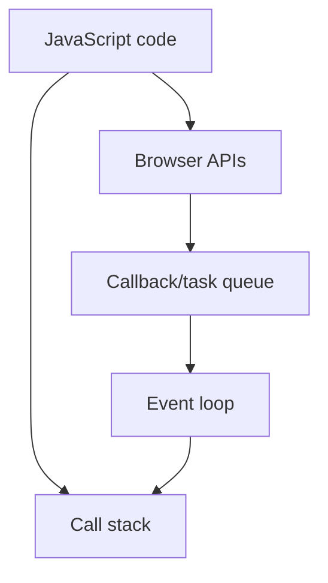

so the loop can just iterate so we need filter to filer out most of the stuff to return some values

const myNums = [1, 2, 3, 4, 5, 6, 7, 8, 9, 10]

// const newNums = myNums.filter( (num) => {
//     return num > 4
// } )

const books = [
{ title: 'Book One', genre: 'Fiction', publish: 1981, edition: 2004 },
{ title: 'Book Two', genre: 'Non-Fiction', publish: 1992, edition: 2008 },
{ title: 'Book Three', genre: 'History', publish: 1999, edition: 2007 },
{ title: 'Book Four', genre: 'Non-Fiction', publish: 1989, edition: 2010 },
{ title: 'Book Five', genre: 'Science', publish: 2009, edition: 2014 },
{ title: 'Book Six', genre: 'Fiction', publish: 1987, edition: 2010 },
{ title: 'Book Seven', genre: 'History', publish: 1986, edition: 1996 },
{ title: 'Book Eight', genre: 'Science', publish: 2011, edition: 2016 },
{ title: 'Book Nine', genre: 'Non-Fiction', publish: 1981, edition: 1989 },
];

let userBooks = books.filter( (bk) => bk.genre === 'History')

## Map

const newNums = myNumers
.map((num) => num * 10 )
.map( (num) => num + 1)
.filter( (num) => num >= 40)

## Reduse

const myNums = [1, 2, 3]

const myTotal = myNums.reduce( (acc, curr) => acc+curr, 0)

sum of the array ans 6

const shoppingCart = [
{
itemName: "js course",
price: 2999
},
{
itemName: "py course",
price: 999
},
{
itemName: "mobile dev course",
price: 5999
},
{
itemName: "data science course",
price: 12999
},
]

const priceToPay = shoppingCart.reduce((acc, item) => acc + item.price, 0)

## Revision notes

### What it is

Filter creates a new array containing only items that pass a condition.

### Why it matters

- It helps you understand the main job of `filters`.
- It gives a mental model for interviews, revision, and building real projects.
- It connects with nearby notes in this vault, so revise it with the content table and related links.

### How to think about it

Ask these questions:

- What problem does it solve?
- What are the main parts?
- What happens step by step?
- Where is it used in real projects?
- What mistake should I avoid?

### Diagram

### Key terms

`callback`, `condition`, `boolean`, `array method`

### Real project example

In a real app, `filters` is not learned alone. It connects with frontend, backend, database, browser, network, and deployment decisions.

Example revision flow:

1. Define the topic in one sentence.
2. Draw the flow from memory.
3. Explain one real use case.
4. Say one advantage.
5. Say one limitation or mistake.

### Common mistakes

- Memorizing the word but not knowing the flow.
- Not knowing when to use it.
- Mixing similar topics without comparing them.
- Forgetting the tradeoff.

### Quick revision

- Main idea: Filter creates a new array containing only items that pass a condition.
- Remember the keywords: callback, condition, boolean, array method.
- Best way to revise: explain it out loud with a small example and the diagram.
