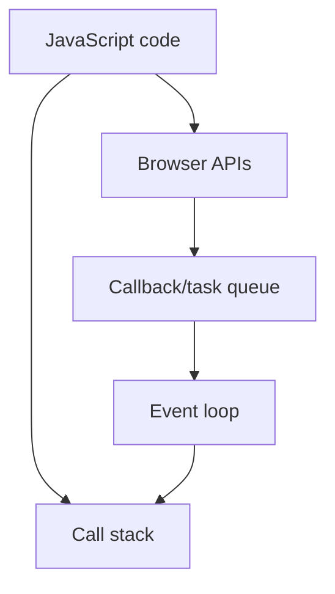

## Normal Js function

function addTwoNumbers(number1, number2){
let result = number1 + number2
return result
return number1 + number2
}

const result = addTwoNumbers(3, 5)

## Variable function

const a=function()
{
console.log("hi");
}

so this is a named function where we store the function in a variable

so to call this we use

- *a();**

## Arrow function

const chai =  () => {
let username = "hitesh"
console.log(this);
}

so to avoid using  function

const b=()=>{
console.log("hi")
}

to call this same b()

- *return type**

const addTwo = (num1, num2) => {
return num1 + num2
}

id we are not using a bracket so we do not require return

const addTwo = (num1, num2) =>  num1 + num2
so here if we do now use any bracket as it is a single line thing

## IIFE

(function chai(){
// named IIFE
console.log(`DB CONNECTED`);
})();

( (name) => {
console.log(`DB CONNECTED TWO ${name}`);
} )('hitesh')

so this code is auto called

## Revision notes

### What it is

Functions group reusable logic and can accept parameters and return values.

### Why it matters

- It helps you understand the main job of `functions`.
- It gives a mental model for interviews, revision, and building real projects.
- It connects with nearby notes in this vault, so revise it with the content table and related links.

### How to think about it

Ask these questions:

- What problem does it solve?
- What are the main parts?
- What happens step by step?
- Where is it used in real projects?
- What mistake should I avoid?

### Diagram

### Key terms

`parameter`, `argument`, `return`, `arrow function`, `callback`

### Real project example

In a real app, `functions` is not learned alone. It connects with frontend, backend, database, browser, network, and deployment decisions.

Example revision flow:

1. Define the topic in one sentence.
2. Draw the flow from memory.
3. Explain one real use case.
4. Say one advantage.
5. Say one limitation or mistake.

### Common mistakes

- Memorizing the word but not knowing the flow.
- Not knowing when to use it.
- Mixing similar topics without comparing them.
- Forgetting the tradeoff.

### Quick revision

- Main idea: Functions group reusable logic and can accept parameters and return values.
- Remember the keywords: parameter, argument, return, arrow function.
- Best way to revise: explain it out loud with a small example and the diagram.
