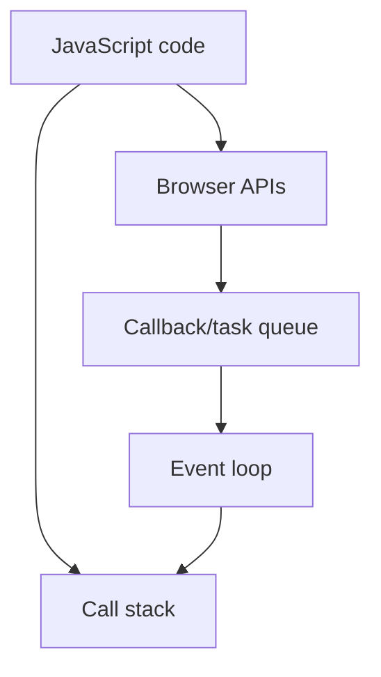

Example

function one()
{
const h="user";
function two()
{
const w="abc";
console.log(h)l

}
two()
}
one()

so w is not accessed by function one

## HOISTING

console.log(addone(5))

function addone(num){
return num + 1
}

addTwo(5)
const addTwo = function(num){
return num + 2
}

so this will ork because of hoisting

## Revision notes

### What it is

Scope decides where variables can be accessed.

### Why it matters

- It helps you understand the main job of `scope`.
- It gives a mental model for interviews, revision, and building real projects.
- It connects with nearby notes in this vault, so revise it with the content table and related links.

### How to think about it

Ask these questions:

- What problem does it solve?
- What are the main parts?
- What happens step by step?
- Where is it used in real projects?
- What mistake should I avoid?

### Diagram

### Key terms

`global scope`, `function scope`, `block scope`, `closure`

### Real project example

In a real app, `scope` is not learned alone. It connects with frontend, backend, database, browser, network, and deployment decisions.

Example revision flow:

1. Define the topic in one sentence.
2. Draw the flow from memory.
3. Explain one real use case.
4. Say one advantage.
5. Say one limitation or mistake.

### Common mistakes

- Memorizing the word but not knowing the flow.
- Not knowing when to use it.
- Mixing similar topics without comparing them.
- Forgetting the tradeoff.

### Quick revision

- Main idea: Scope decides where variables can be accessed.
- Remember the keywords: global scope, function scope, block scope, closure.
- Best way to revise: explain it out loud with a small example and the diagram.
