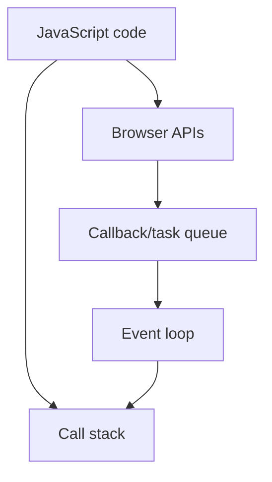

## Strings

console.log(`Hello my name is ${name} and my repo count is ${repoCount}`);

so here we are using a var to print the value dynamic value
name can be any thing

- *Syntax**

${var} this wi;l replace the vale in var here

## Complete notes

String is text data in JavaScript.

## Examples

```js

const name = "Priyanshu";
const city = 'Delhi';
const message = `Hello ${name}`;

```

## Useful methods

- `length` gives size.
- `toUpperCase()` makes uppercase.
- `toLowerCase()` makes lowercase.
- `includes()` checks if text exists.
- `slice()` cuts part of string.
- `split()` converts string into array.
- `trim()` removes outside spaces.

## Important point

Strings are immutable.
That means methods return a new string instead of changing the original string.

## Revision notes

### What it is

String is text data in JavaScript.

### Why it matters

- It helps you understand the main job of `strings`.
- It gives a mental model for interviews, revision, and building real projects.
- It connects with nearby notes in this vault, so revise it with the content table and related links.

### How to think about it

Ask these questions:

- What problem does it solve?
- What are the main parts?
- What happens step by step?
- Where is it used in real projects?
- What mistake should I avoid?

### Diagram



### Key terms

`length`, `slice`, `split`, `includes`, `template literal`

### Real project example

In a real app, `strings` is not learned alone. It connects with frontend, backend, database, browser, network, and deployment decisions.

Example revision flow:

1. Define the topic in one sentence.
2. Draw the flow from memory.
3. Explain one real use case.
4. Say one advantage.
5. Say one limitation or mistake.

### Common mistakes

- Memorizing the word but not knowing the flow.
- Not knowing when to use it.
- Mixing similar topics without comparing them.
- Forgetting the tradeoff.

### Quick revision

- Main idea: String is text data in JavaScript.
- Remember the keywords: length, slice, split, includes.
- Best way to revise: explain it out loud with a small example and the diagram.
