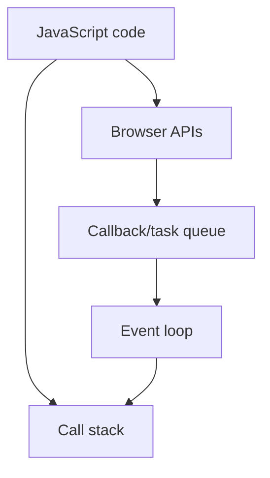

## **Different types of Variables**

const accountId = 144553
let accountEmail = "hitesh@google.com"
var accountPassword = "12345"
accountCity = "Jaipur"
let accountState;

let name = "hitesh"
let age = 18
let isLoggedIn = false
let state;

## default  values

// number => 2 to power 53
// bigint
// string => ""
// boolean => true/false
// null => standalone value
// undefined =>
// symbol => unique

## **Objects**

console.log(typeof undefined); // undefined
console.log(typeof null); // object

## Special Comparision

=== type +the value
3== "3" => true
3=== "3" false

also

console.log(undefined == 0);
console.log(undefined > 0);
console.log(undefined < 0);

all are false

## Revision notes

### What it is

Variables store values using let, const, or var.

### Why it matters

- It helps you understand the main job of `variables`.
- It gives a mental model for interviews, revision, and building real projects.
- It connects with nearby notes in this vault, so revise it with the content table and related links.

### How to think about it

Ask these questions:

- What problem does it solve?
- What are the main parts?
- What happens step by step?
- Where is it used in real projects?
- What mistake should I avoid?

### Diagram

### Key terms

`let`, `const`, `var`, `scope`, `reassignment`

### Real project example

In a real app, `variables` is not learned alone. It connects with frontend, backend, database, browser, network, and deployment decisions.

Example revision flow:

1. Define the topic in one sentence.
2. Draw the flow from memory.
3. Explain one real use case.
4. Say one advantage.
5. Say one limitation or mistake.

### Common mistakes

- Memorizing the word but not knowing the flow.
- Not knowing when to use it.
- Mixing similar topics without comparing them.
- Forgetting the tradeoff.

### Quick revision

- Main idea: Variables store values using let, const, or var.
- Remember the keywords: let, const, var, scope.
- Best way to revise: explain it out loud with a small example and the diagram.
