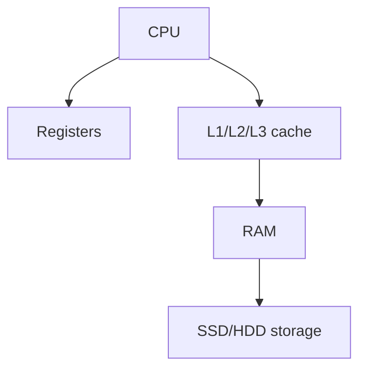

# BIOS

it is a basic input output system
it is the first part that run when the system is run's
starting power to computer
providing  a control to operating system

## Complete notes

BIOS means Basic Input Output System.

It starts before the operating system.

## What BIOS does

- Checks hardware.
- Finds boot device.
- Starts the operating system boot process.
- Provides low-level setup options.

## POST

POST means Power-On Self-Test.
It checks if important hardware like RAM, keyboard, and storage are working.

## Modern note

Many modern computers use UEFI, which is newer than traditional BIOS.

## Revision notes

### What it is

BIOS/UEFI initializes hardware and starts the boot process.

### Why it matters

- It helps you understand the main job of `BIOS`.
- It gives a mental model for interviews, revision, and building real projects.
- It connects with nearby notes in this vault, so revise it with the content table and related links.

### How to think about it

Ask these questions:

- What problem does it solve?
- What are the main parts?
- What happens step by step?
- Where is it used in real projects?
- What mistake should I avoid?

### Diagram

### Key terms

`POST`, `firmware`, `boot device`, `UEFI`

### Real project example

In a real app, `BIOS` is not learned alone. It connects with frontend, backend, database, browser, network, and deployment decisions.

Example revision flow:

1. Define the topic in one sentence.
2. Draw the flow from memory.
3. Explain one real use case.
4. Say one advantage.
5. Say one limitation or mistake.

### Common mistakes

- Memorizing the word but not knowing the flow.
- Not knowing when to use it.
- Mixing similar topics without comparing them.
- Forgetting the tradeoff.

### Quick revision

- Main idea: BIOS/UEFI initializes hardware and starts the boot process.
- Remember the keywords: POST, firmware, boot device, UEFI.
- Best way to revise: explain it out loud with a small example and the diagram.
