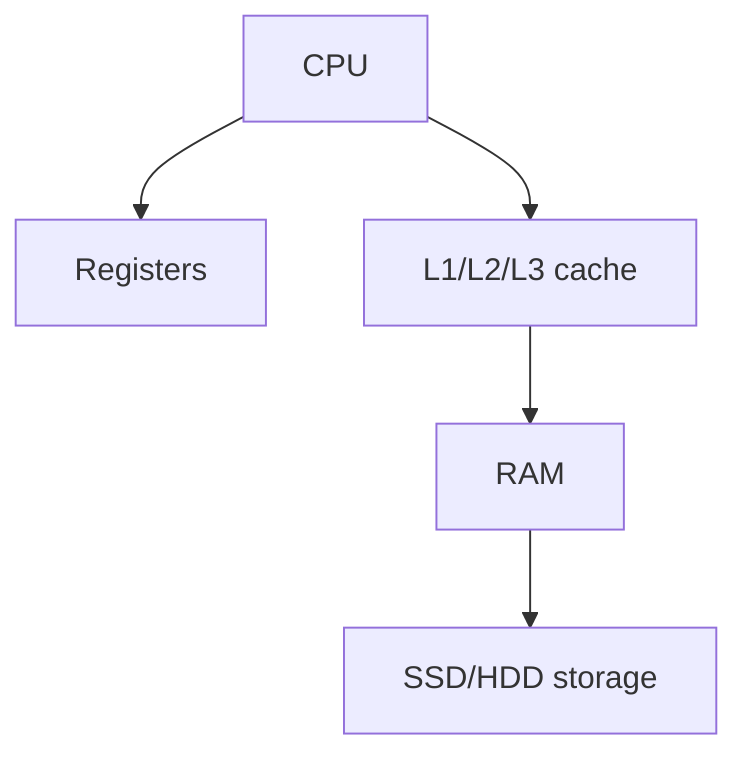

## Types of DDR SDRAM

- DDR$
- DDR5

## Complete notes

DDR SDRAM means Double Data Rate Synchronous Dynamic RAM.

It is a type of RAM used in computers.

## Main idea

DDR transfers data twice per clock cycle.
That gives better speed than older SDRAM.

## Versions

- DDR3
- DDR4
- DDR5

Newer versions usually improve speed, bandwidth, and power efficiency.

## Revision notes

### What it is

DDR SDRAM transfers data twice per clock cycle and is common system RAM.

### Why it matters

- It helps you understand the main job of `DDR SDRAM`.
- It gives a mental model for interviews, revision, and building real projects.
- It connects with nearby notes in this vault, so revise it with the content table and related links.

### How to think about it

Ask these questions:

- What problem does it solve?
- What are the main parts?
- What happens step by step?
- Where is it used in real projects?
- What mistake should I avoid?

### Diagram

### Key terms

`DDR3`, `DDR4`, `DDR5`, `bandwidth`

### Real project example

In a real app, `DDR SDRAM` is not learned alone. It connects with frontend, backend, database, browser, network, and deployment decisions.

Example revision flow:

1. Define the topic in one sentence.
2. Draw the flow from memory.
3. Explain one real use case.
4. Say one advantage.
5. Say one limitation or mistake.

### Common mistakes

- Memorizing the word but not knowing the flow.
- Not knowing when to use it.
- Mixing similar topics without comparing them.
- Forgetting the tradeoff.

### Quick revision

- Main idea: DDR SDRAM transfers data twice per clock cycle and is common system RAM.
- Remember the keywords: DDR3, DDR4, DDR5, bandwidth.
- Best way to revise: explain it out loud with a small example and the diagram.
