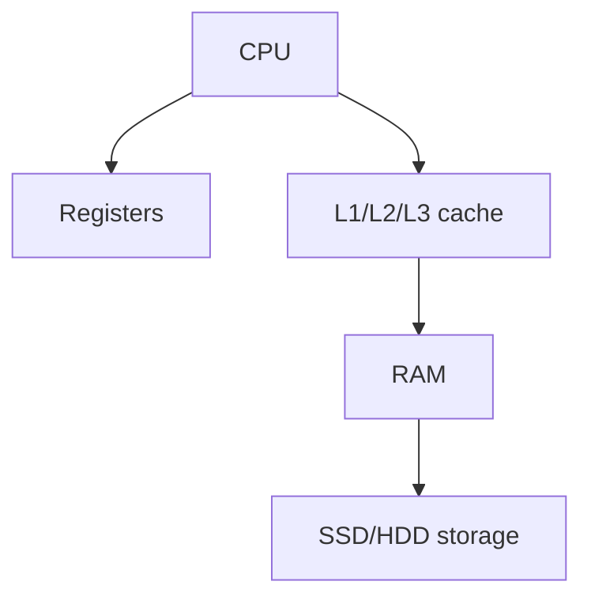

Dynamic Ramdon access memory
it is slow and cheap compared to SRAM
it needs to be constantly refreshed

it is high maintenance

## TYPE of DRAM

- FPM DRAM[[FPM DRAM]]  not used
- EDO  DRAM[[EDO  DRAM]]. not used
- SDRAM[[ SDRAM]]
- DDR SDRAM[[DDR SDRAM]]
- GDDRM SDRM[[ GDDRM SDRM]]

## Complete notes

DRAM means Dynamic Random Access Memory.

It is a common type of RAM used in computers.

## Why dynamic

DRAM stores data in capacitors.
Capacitors lose charge, so DRAM must be refreshed again and again.

## Good point

It is cheaper and denser than SRAM.

## Weak point

It is slower than SRAM.

## Use case

Main memory in computers, laptops, and servers.

## Revision notes

### What it is

DRAM is common main memory that must be refreshed repeatedly.

### Why it matters

- It helps you understand the main job of `DRAM`.
- It gives a mental model for interviews, revision, and building real projects.
- It connects with nearby notes in this vault, so revise it with the content table and related links.

### How to think about it

Ask these questions:

- What problem does it solve?
- What are the main parts?
- What happens step by step?
- Where is it used in real projects?
- What mistake should I avoid?

### Diagram

### Key terms

`capacitor`, `refresh`, `density`, `main memory`

### Real project example

In a real app, `DRAM` is not learned alone. It connects with frontend, backend, database, browser, network, and deployment decisions.

Example revision flow:

1. Define the topic in one sentence.
2. Draw the flow from memory.
3. Explain one real use case.
4. Say one advantage.
5. Say one limitation or mistake.

### Common mistakes

- Memorizing the word but not knowing the flow.
- Not knowing when to use it.
- Mixing similar topics without comparing them.
- Forgetting the tradeoff.

### Quick revision

- Main idea: DRAM is common main memory that must be refreshed repeatedly.
- Remember the keywords: capacitor, refresh, density, main memory.
- Best way to revise: explain it out loud with a small example and the diagram.
