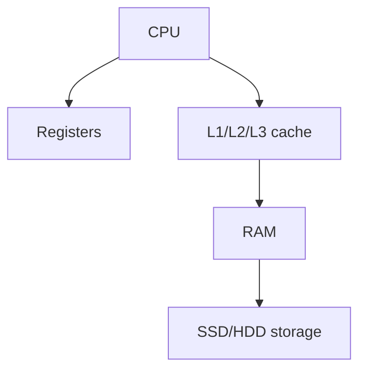

# Firewares

type of software that storing ROM
it controls how hardware devices control rom

## Complete notes

Firmware is low-level software stored inside hardware devices.

## Examples

- Router firmware.
- Keyboard firmware.
- BIOS/UEFI firmware.
- SSD firmware.
- Phone firmware.

## Why firmware matters

It tells hardware how to work before normal software controls it.

## Firmware update

Firmware updates can fix bugs, improve security, and add hardware support.
But wrong firmware update can break a device, so it should be done carefully.

## Revision notes

### What it is

Firmware is low-level software inside hardware devices.

### Why it matters

- It helps you understand the main job of `Firewares`.
- It gives a mental model for interviews, revision, and building real projects.
- It connects with nearby notes in this vault, so revise it with the content table and related links.

### How to think about it

Ask these questions:

- What problem does it solve?
- What are the main parts?
- What happens step by step?
- Where is it used in real projects?
- What mistake should I avoid?

### Diagram

### Key terms

`hardware control`, `update`, `embedded`, `BIOS`

### Real project example

In a real app, `Firewares` is not learned alone. It connects with frontend, backend, database, browser, network, and deployment decisions.

Example revision flow:

1. Define the topic in one sentence.
2. Draw the flow from memory.
3. Explain one real use case.
4. Say one advantage.
5. Say one limitation or mistake.

### Common mistakes

- Memorizing the word but not knowing the flow.
- Not knowing when to use it.
- Mixing similar topics without comparing them.
- Forgetting the tradeoff.

### Quick revision

- Main idea: Firmware is low-level software inside hardware devices.
- Remember the keywords: hardware control, update, embedded, BIOS.
- Best way to revise: explain it out loud with a small example and the diagram.
