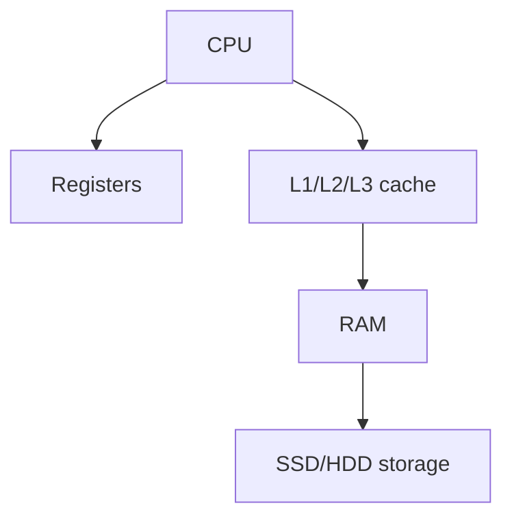

# GDDRM SDRM

so this is the fasted  DRAM
gpu used for  processiing

## Complete notes

This note is about GDDR SDRAM.

GDDR means Graphics Double Data Rate.

It is memory used mainly in graphics cards.

## Why GPU needs it

GPU needs very high bandwidth to process images, video, 3D graphics, and AI workloads.

## Examples

- GDDR5
- GDDR6
- GDDR6X

## Difference from normal DDR

Normal DDR is for system RAM.
GDDR is optimized for graphics and high bandwidth.

## Revision notes

### What it is

GDDR memory is high-bandwidth memory for graphics cards.

### Why it matters

- It helps you understand the main job of `GDDRM SDRM`.
- It gives a mental model for interviews, revision, and building real projects.
- It connects with nearby notes in this vault, so revise it with the content table and related links.

### How to think about it

Ask these questions:

- What problem does it solve?
- What are the main parts?
- What happens step by step?
- Where is it used in real projects?
- What mistake should I avoid?

### Diagram

### Key terms

`GPU`, `bandwidth`, `VRAM`, `graphics`

### Real project example

In a real app, `GDDRM SDRM` is not learned alone. It connects with frontend, backend, database, browser, network, and deployment decisions.

Example revision flow:

1. Define the topic in one sentence.
2. Draw the flow from memory.
3. Explain one real use case.
4. Say one advantage.
5. Say one limitation or mistake.

### Common mistakes

- Memorizing the word but not knowing the flow.
- Not knowing when to use it.
- Mixing similar topics without comparing them.
- Forgetting the tradeoff.

### Quick revision

- Main idea: GDDR memory is high-bandwidth memory for graphics cards.
- Remember the keywords: GPU, bandwidth, VRAM, graphics.
- Best way to revise: explain it out loud with a small example and the diagram.
