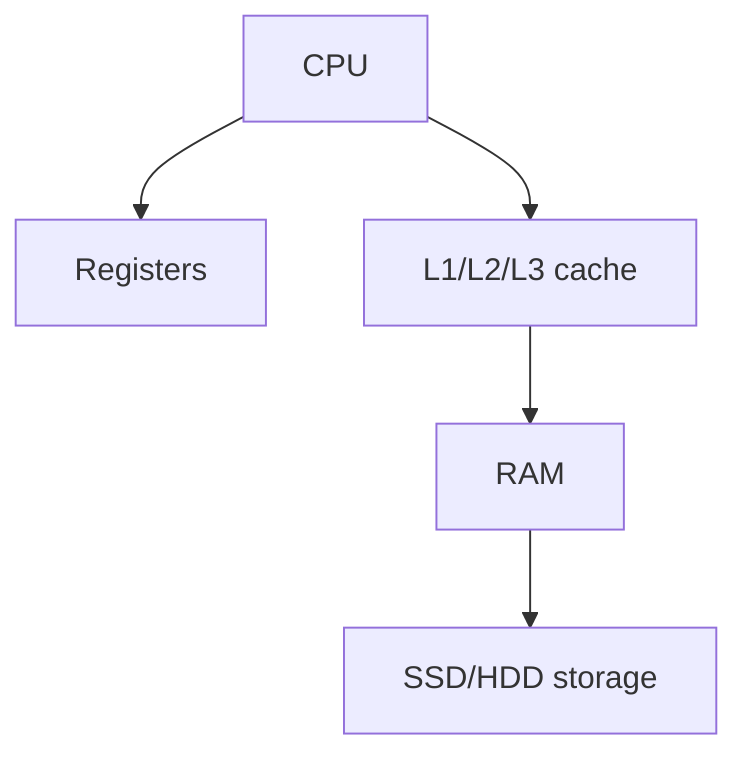

## Complete notes

HDD means Hard Disk Drive.

It stores data using spinning magnetic disks.

## Good points

- Cheaper for large storage.
- Good for backups and bulk data.
- Available in high capacity.

## Weak points

- Slower than SSD.
- Has moving parts.
- Can be damaged by shock.

## HDD vs SSD

- HDD is cheaper but slower.
- SSD is faster and has no moving parts.
- SSD is better for operating system and apps.
- HDD is still useful for large files and backups.

## Revision notes

### What it is

HDD stores data permanently using spinning magnetic disks.

### Why it matters

- It helps you understand the main job of `HDD`.
- It gives a mental model for interviews, revision, and building real projects.
- It connects with nearby notes in this vault, so revise it with the content table and related links.

### How to think about it

Ask these questions:

- What problem does it solve?
- What are the main parts?
- What happens step by step?
- Where is it used in real projects?
- What mistake should I avoid?

### Diagram

### Key terms

`platter`, `read/write head`, `capacity`, `latency`

### Real project example

In a real app, `HDD` is not learned alone. It connects with frontend, backend, database, browser, network, and deployment decisions.

Example revision flow:

1. Define the topic in one sentence.
2. Draw the flow from memory.
3. Explain one real use case.
4. Say one advantage.
5. Say one limitation or mistake.

### Common mistakes

- Memorizing the word but not knowing the flow.
- Not knowing when to use it.
- Mixing similar topics without comparing them.
- Forgetting the tradeoff.

### Quick revision

- Main idea: HDD stores data permanently using spinning magnetic disks.
- Remember the keywords: platter, read/write head, capacity, latency.
- Best way to revise: explain it out loud with a small example and the diagram.
