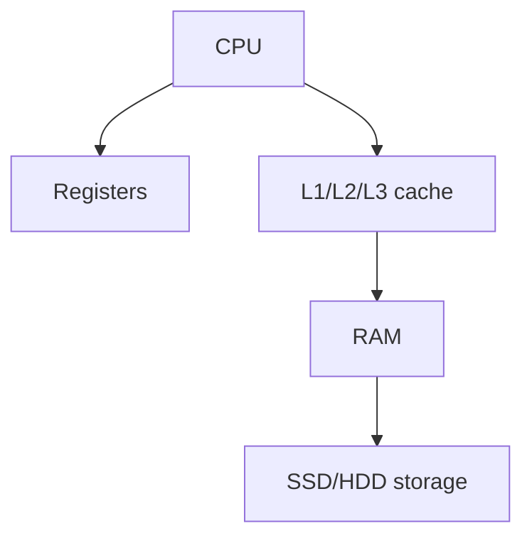

## types of memory

- RAM[[RAM]]
- ROM[[ROM]]

## Complete notes

Memory means fast storage used by computer while working.

## Types

- Registers are inside CPU and are fastest.
- Cache is very fast memory near CPU.
- RAM stores running programs and data.
- Virtual memory uses storage as extra memory when RAM is not enough.

## Memory vs storage

- Memory is fast and temporary.
- Storage is slower but permanent.

## Example

Opening an app loads data from storage into memory.

## Revision notes

### What it is

Memory is fast temporary working space used while programs run.

### Why it matters

- It helps you understand the main job of `Memory`.
- It gives a mental model for interviews, revision, and building real projects.
- It connects with nearby notes in this vault, so revise it with the content table and related links.

### How to think about it

Ask these questions:

- What problem does it solve?
- What are the main parts?
- What happens step by step?
- Where is it used in real projects?
- What mistake should I avoid?

### Diagram

### Key terms

`register`, `cache`, `RAM`, `virtual memory`

### Real project example

In a real app, `Memory` is not learned alone. It connects with frontend, backend, database, browser, network, and deployment decisions.

Example revision flow:

1. Define the topic in one sentence.
2. Draw the flow from memory.
3. Explain one real use case.
4. Say one advantage.
5. Say one limitation or mistake.

### Common mistakes

- Memorizing the word but not knowing the flow.
- Not knowing when to use it.
- Mixing similar topics without comparing them.
- Forgetting the tradeoff.

### Quick revision

- Main idea: Memory is fast temporary working space used while programs run.
- Remember the keywords: register, cache, RAM, virtual memory.
- Best way to revise: explain it out loud with a small example and the diagram.
