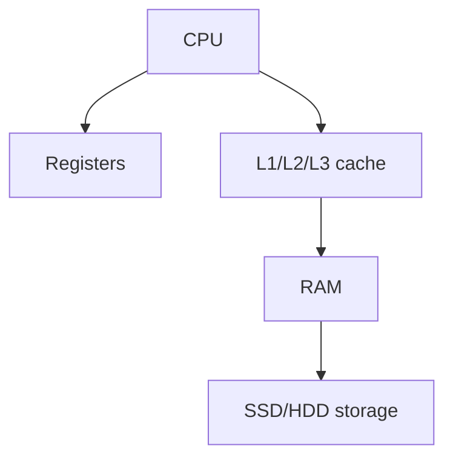

random access memory
so data is stored for a short time here
it is deleted when the system is closed

## Typs of RAM

- SRAM[[SRAM]]
- DRAM[[DRAM]]

## Complete notes

RAM means Random Access Memory.

It is temporary memory used while computer is running.

## Why RAM is important

- Apps load into RAM when running.
- More RAM helps multitasking.
- CPU can access RAM faster than storage.

## Important point

RAM is volatile.
That means data is lost when power is off.

## Example

When you open Chrome, VS Code, or a game, active data is kept in RAM.

## Revision notes

### What it is

RAM stores active program data while the computer is on.

### Why it matters

- It helps you understand the main job of `RAM`.
- It gives a mental model for interviews, revision, and building real projects.
- It connects with nearby notes in this vault, so revise it with the content table and related links.

### How to think about it

Ask these questions:

- What problem does it solve?
- What are the main parts?
- What happens step by step?
- Where is it used in real projects?
- What mistake should I avoid?

### Diagram

### Key terms

`volatile`, `read/write`, `multitasking`, `speed`

### Real project example

In a real app, `RAM` is not learned alone. It connects with frontend, backend, database, browser, network, and deployment decisions.

Example revision flow:

1. Define the topic in one sentence.
2. Draw the flow from memory.
3. Explain one real use case.
4. Say one advantage.
5. Say one limitation or mistake.

### Common mistakes

- Memorizing the word but not knowing the flow.
- Not knowing when to use it.
- Mixing similar topics without comparing them.
- Forgetting the tradeoff.

### Quick revision

- Main idea: RAM stores active program data while the computer is on.
- Remember the keywords: volatile, read/write, multitasking, speed.
- Best way to revise: explain it out loud with a small example and the diagram.
