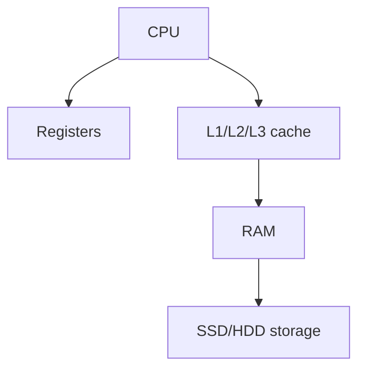

Read only memory
so this is not deleted when the power is cut off

non volatile
so it is storage thing

## Types of ROM

- Firewares[[Firewares]]
- BIOS[[BIOS]]

-

## Complete notes

ROM means Read Only Memory.

It stores important instructions needed to start the computer or device.

## Important point

ROM is non-volatile.
That means data stays even after power is off.

## Use cases

- Boot instructions.
- Firmware.
- Embedded devices.
- BIOS/UEFI storage in computers.

## RAM vs ROM

- RAM is temporary and writable.
- ROM is permanent and usually not changed often.

## Revision notes

### What it is

ROM stores important startup instructions and keeps data without power.

### Why it matters

- It helps you understand the main job of `ROM`.
- It gives a mental model for interviews, revision, and building real projects.
- It connects with nearby notes in this vault, so revise it with the content table and related links.

### How to think about it

Ask these questions:

- What problem does it solve?
- What are the main parts?
- What happens step by step?
- Where is it used in real projects?
- What mistake should I avoid?

### Diagram

### Key terms

`non-volatile`, `firmware`, `boot`, `read-only`

### Real project example

In a real app, `ROM` is not learned alone. It connects with frontend, backend, database, browser, network, and deployment decisions.

Example revision flow:

1. Define the topic in one sentence.
2. Draw the flow from memory.
3. Explain one real use case.
4. Say one advantage.
5. Say one limitation or mistake.

### Common mistakes

- Memorizing the word but not knowing the flow.
- Not knowing when to use it.
- Mixing similar topics without comparing them.
- Forgetting the tradeoff.

### Quick revision

- Main idea: ROM stores important startup instructions and keeps data without power.
- Remember the keywords: non-volatile, firmware, boot, read-only.
- Best way to revise: explain it out loud with a small example and the diagram.
