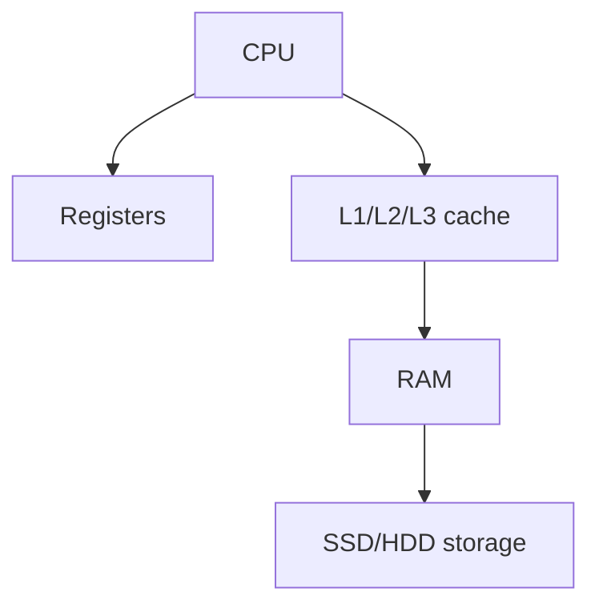

# SRAM

it is a static type of memory
used in high speed applications
this is used where cpu [[API Caching with Redis|caching]] is used quick access time is important

- cpu caches
- Faster than DRAM

## Complete notes

SRAM means Static Random Access Memory.

It is faster than DRAM and does not need constant refreshing.

## Good point

- Very fast.
- Used close to CPU.

## Weak point

- More expensive.
- Takes more space.

## Use case

CPU [[cache]] like L1, L2, and L3 often uses SRAM.

## Revision notes

### What it is

SRAM is very fast memory often used for CPU cache.

### Why it matters

- It helps you understand the main job of `SRAM`.
- It gives a mental model for interviews, revision, and building real projects.
- It connects with nearby notes in this vault, so revise it with the content table and related links.

### How to think about it

Ask these questions:

- What problem does it solve?
- What are the main parts?
- What happens step by step?
- Where is it used in real projects?
- What mistake should I avoid?

### Diagram

### Key terms

`fast`, `expensive`, `cache`, `no refresh`

### Real project example

In a real app, `SRAM` is not learned alone. It connects with frontend, backend, database, browser, network, and deployment decisions.

Example revision flow:

1. Define the topic in one sentence.
2. Draw the flow from memory.
3. Explain one real use case.
4. Say one advantage.
5. Say one limitation or mistake.

### Common mistakes

- Memorizing the word but not knowing the flow.
- Not knowing when to use it.
- Mixing similar topics without comparing them.
- Forgetting the tradeoff.

### Quick revision

- Main idea: SRAM is very fast memory often used for CPU cache.
- Remember the keywords: fast, expensive, cache, no refresh.
- Best way to revise: explain it out loud with a small example and the diagram.
