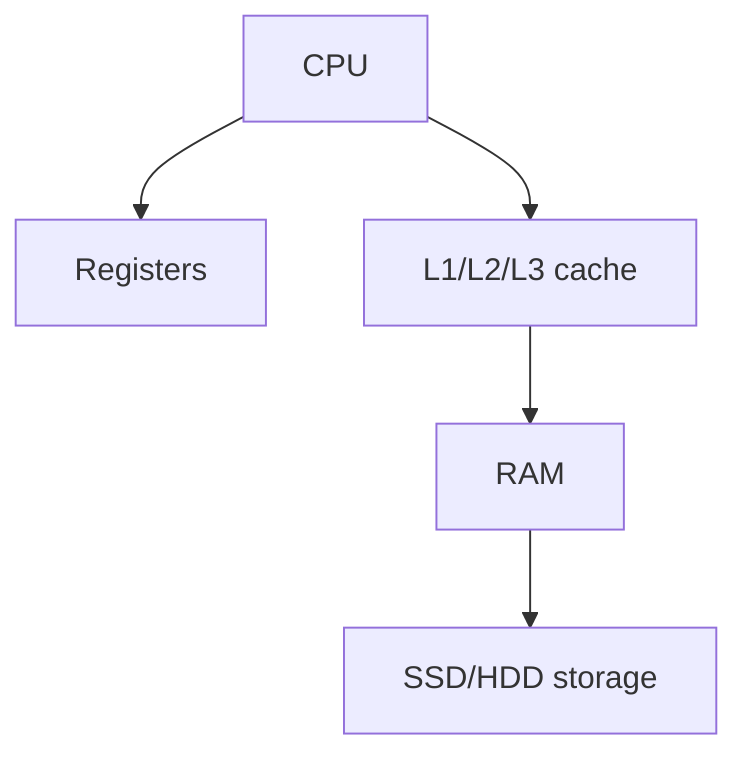

# Storages

types of drive

- hdd[[HDD]]
- SSDSSD
- USBUSB
- SD cardSD Cards

## Complete notes

Storage keeps data permanently.

It is non-volatile, so data stays after power off.

## Common storage types

- HDD
- SSD
- USB drive
- Memory card
- Cloud storage

## Important measurements

- Capacity means how much data it can store.
- Speed means how fast it can read/write.
- Latency means delay before data starts moving.
- Durability means how long it can last.

## Revision notes

### What it is

Storage keeps files and data permanently after power is off.

### Why it matters

- It helps you understand the main job of `Storages`.
- It gives a mental model for interviews, revision, and building real projects.
- It connects with nearby notes in this vault, so revise it with the content table and related links.

### How to think about it

Ask these questions:

- What problem does it solve?
- What are the main parts?
- What happens step by step?
- Where is it used in real projects?
- What mistake should I avoid?

### Diagram

### Key terms

`SSD`, `HDD`, `capacity`, `IOPS`, `[[Backup and Restore|backup]]`

### Real project example

In a real app, `Storages` is not learned alone. It connects with frontend, backend, database, browser, network, and deployment decisions.

Example revision flow:

1. Define the topic in one sentence.
2. Draw the flow from memory.
3. Explain one real use case.
4. Say one advantage.
5. Say one limitation or mistake.

### Common mistakes

- Memorizing the word but not knowing the flow.
- Not knowing when to use it.
- Mixing similar topics without comparing them.
- Forgetting the tradeoff.

### Quick revision

- Main idea: Storage keeps files and data permanently after power is off.
- Remember the keywords: SSD, HDD, capacity, IOPS.
- Best way to revise: explain it out loud with a small example and the diagram.
